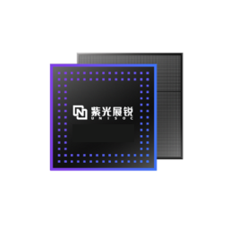

# SFD Tool

SFD Tool is a cross‑platform GUI and CLI tool for working with Spreadtrum/UNISOC devices.
It focuses on **safe partition backup/restore, PAC flashing, and advanced maintenance
operations**, with first‑class support for modern 64‑bit platforms.

> NOTE: This README is a high‑level English overview. The **Chinese user guide**
> in [docs/USER_GUIDE_ZH.md](docs/USER_GUIDE_ZH.md) is the canonical, most
> detailed end‑user documentation.




## Introduction


This is the modified version of tool 'spreadtrum_flash'

sfd_tool is a maintenance release for spreadtrum_flash

**(This version adds GTK3 graphical interface)**

[spreadtrum_flash](https://github.com/TomKing062/spreadtrum_flash)

---

Run this before making:

``` bash
sudo apt update
# Ubuntu/Debian
sudo apt install libusb-1.0-0-dev gcc g++ libgtk-3-dev pkg-config make cmake
# Fedora/RHEL
sudo dnf install gcc-c++ gtk3-devel libusb1-devel libusb1 pkgconf-pkg-config make cmake
# macOS
brew install libusb gtk+3 pkg-config make cmake
# Android(Termux)
pkg install x11-repo
pkg install termux-api libusb clang git pkg-config gtk3 glib pango libcairo gdk-pixbuf at-spi2-core xorgproto xorg-util-macros make cmake
```

Then make:
``` bash
make
# Termux
make termux
# Locate
make locates
```

Use on Termux(No GUI):

``` bash
# Search OTG device
termux-usb -l
# example
#[
#  "/dev/bus/usb/xxx/xxx"
#]
# Authorize OTG device
termux-usb -r /dev/bus/usb/xxx/xxx
# Run(example)
termux-usb -e './sfd_tool --no-gui --usb-fd' /dev/bus/usb/xxx/xxx
```

**WARN : You may must run tool as root to connect to device correctly!**

---

***Modified commands:***

    part_table [FILE PATH]

**This command is equivalent to the `partition_list` command.**

    exec_addr [BINARY FILE] [ADDR]
    
**Modified, you need to provide file path and address**

    exec <ADDR>

**Modified, you need to provide FDL1 address when you execute FDL1**

    read_spec [PART NAME] [OFFSET] [SIZE] [FILE]

**Modified, equivalent to the `read_part` command, then `read_part` is equivalent to the `r`**

    --no-fdl

**New option, execute it if you want to connect to device without FDL1/2(Only Sprd4 Mode).**

    cptable
    
**New command, use it to get partition table through compatibility method(FDL2 only)**

    --no-gui

**New parameter, open sfd_tool without GUI**


## Features

- **Cross‑platform GUI** (GTK3)
  - Tabs for Connect, Partition Operation, PAC Flash, Manual Operation,
    Advanced Operation, Advanced Settings, Debug Options, Log, and About.
- **Partition backup and restore**
  - Read/write individual partitions.
  - Block‑size‑aware backup/restore pipeline to avoid alignment issues.
  - **Restore from folder**: batch restore multiple partitions from a folder
    of images (see user guide for details).
- **PAC firmware flashing**
  - Inspect PAC contents and flash selected partitions.
- **Manual low‑level operations**
  - Read/write by address, execute code at arbitrary addresses, etc.
- **Advanced maintenance tools**
  - AVB and boot‑chain related operations.
  - Other expert‑only functions for debugging and recovery.
- **CLI mode**
  - Run without GUI using `--no-gui`.
  - Rich command set for scripting and headless environments.
- **Internationalisation (i18n)**
  - Translated UI (e.g. `zh_CN`, `en_US`), using gettext `.po`/`.mo` files.

## Supported platforms & binaries

SFD Tool is primarily tested and released for:

- **Windows 10/11 x64**
- **Linux x86_64** (e.g. Debian/Ubuntu, RPM‑based distros)
- **macOS** (recent versions)
- **Termux / Android** (CLI only, via `--no-gui`)

Prebuilt binaries and packages are provided on GitHub Releases, typically including:

- Windows x64 executables (LibUSB and/or SPRD driver builds).
- `.deb` packages for popular Debian/Ubuntu versions.
- `.rpm` packages for RPM‑based distributions.
- macOS `.dmg` application bundles.

> Windows x86 builds have been removed in recent versions. Only x64 is
> supported going forward.

For exact platforms and artifact names, refer to the latest release page and
[.github/workflows/build.yml](.github/workflows/build.yml).

## Building from source (CMake)

SFD Tool uses **CMake** as the primary build system. The legacy Makefile is
kept only for reference.

Basic out‑of‑source build (example):

```bash
cmake -S . -B build -DCMAKE_BUILD_TYPE=Release
cmake --build build -j
```

On Windows you can use a Visual Studio generator, on macOS and Linux Ninja or
Makefiles. See:

- [docs/cmake_EN.md](docs/cmake_EN.md) – English CMake/build guide.
- [docs/cmake.md](docs/cmake.md) – Chinese CMake/build guide with more
  details, including per‑user config and `ui_language`.

Warn: SPRD Driver version need Proxy32.exe, but it will not be built by cmake, you have to build it with x86 compiler.

## Running

### GUI

After building, run the GUI executable from your build directory, e.g.:

```bash
./build/sfd_tool
```

On installed systems you can start SFD Tool from your desktop environment
(menu entry created by the package) or by running `sfd_tool` from a terminal.

### CLI mode

For headless and scripted environments you can run SFD Tool in CLI mode:

```bash
sfd_tool --no-gui --help
```

This prints the full list of commands and options. Some examples:

- List partition table.
- Read a specific region to a file.
- Execute code at a given address.
- Use `--no-fdl` or similar flags for special boot modes.

For the authoritative CLI reference, see:

- Inline help: `sfd_tool --help`
- Manpage (on Linux): `man sfd-tool`

## Configuration & language

SFD Tool stores per‑user configuration (UI language, recent paths, etc.) in a
JSON config file in the user’s home directory (location varies by platform).

Key points:

- `ui_language` can be set to `auto`, `zh_CN`, `en_US`, etc.
- On first run the tool may migrate legacy config files from the project root
  into the per‑user location.

See [docs/cmake.md](docs/cmake.md) for details.

## Documentation map

- **Chinese user guide (canonical for end users)**
  - [docs/USER_GUIDE_ZH.md](docs/USER_GUIDE_ZH.md)
- **Project overview (English)**
  - This README
  - [README_ZH.md](README_ZH.md) – Chinese overview
- **Architecture & development**
  - [ARCHITECTURE.md](ARCHITECTURE.md)
- **Build & configuration**
  - [docs/cmake_EN.md](docs/cmake_EN.md)
  - [docs/cmake.md](docs/cmake.md)
- **Release & CI (maintainers)**
  - [docs/RELEASE_GUIDE_ZH.md](docs/RELEASE_GUIDE_ZH.md)
  - CI workflow: [.github/workflows/build.yml](.github/workflows/build.yml)
- **Changelog**
  - [docs/VERSION_LOG.md](docs/VERSION_LOG.md) – shown in the About tab.

## Safety and disclaimer

Working with device partitions and bootloaders is inherently risky. Incorrect
operations can brick a device and may lead to data loss.

- Always back up critical partitions before flashing or using advanced tools.
- Do not use functions you do not fully understand.
- Read the warnings in the user guide and on the Advanced Operation tab.

SFD Tool is distributed under the terms of the GPL. See the repository for
license details.
