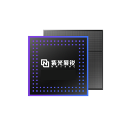

# sfd_tool

[**中文文档**](https://github.com/C-Hidery/sfd_tool/blob/master/README_ZH.md)




The modified version of tool 'spreadtrum_flash'

sfd_tool is a maintenance release for spreadtrum_flash

**(This version adds GTK3 graphical interface)**

[spreadtrum_flash](https://github.com/TomKing062/spreadtrum_flash)

---

Run this before making:

``` bash
sudo apt update
# Ubuntu/Debian
sudo apt install libusb-1.0-0-dev gcc g++ libgtk-3-dev pkg-config
# Fedora/RHEL
sudo dnf install  gcc-c++ gtk3-devel libusb1-devel libusb1 pkgconf-pkg-config make 
# macOS
brew install libusb gtk+3 pkg-config
# Android(Termux)
pkg install x11-repo
pkg install termux-api libusb clang git pkg-config gtk3 glib pango libcairo gdk-pixbuf at-spi2-core xorgproto xorg-util-macros
```

Then make:
``` bash
make
```

Use on Termux(No GUI):

``` bash
# Search OTG device
termux-usb -l
[
  "/dev/bus/usb/xxx/xxx"
]
# Authorize OTG device
termux-usb -r /dev/bus/usb/xxx/xxx
# Run
termux-usb -e './sfd_tool --no-gui --usb-fd' /dev/bus/usb/xxx/xxx
```

**WARN : You may must run tool as root to connect to device correctly!**

---

***Modified commands:***

    part_table [FILE PATH]

**This command is equivalent to the `partition_list` command.**

    exec_addr [BINARY FILE] [ADDR]
    
**Modified, you need to provide file path and address**

    exec <ADDR>

**Modified, you need to provide FDL1 address when you execute FDL1**

    read_spec [PART NAME] [OFFSET] [SIZE] [FILE]

**Modified, equivalent to the `read_part` command, then `read_part` is equivalent to the `r`**

    --no-fdl

**New option, execute it if you want to connect to device without FDL1/2(Only Sprd4 Mode).**

    cptable
    
**New command, use it to get partition table through compatibility method(FDL2 only)**

    --no-gui

**New parameter, open sfd_tool without GUI**
