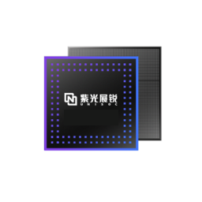

# sfd_tool




工具'spreadtrum_flash'的修改版

sfd_tool是它的一个维护版本（原仓库已存档）

**（此版本添加了GTK3图形化）**

[spreadtrum_flash](https://github.com/TomKing062/spreadtrum_flash)

---

执行make时请先运行这个：

``` bash
sudo apt update
# Ubuntu/Debian
sudo apt install libusb-1.0-0-dev gcc g++ libgtk-3-dev pkg-config
# Fedora/RHEL
sudo dnf install libusb-devel gtk3-devel pkg-config
# macOS
brew install libusb gtk+3 pkg-config
# Android(Termux)
pkg install x11-repo
pkg install termux-api libusb clang git pkg-config gtk3 glib pango libcairo gdk-pixbuf at-spi2-core
```

然后make:
``` bash
make
```

在Termux上使用(No GUI):

``` bash
# 搜索OTG设备
termux-usb -l
[
  "/dev/bus/usb/xxx/xxx"
]
# 授权OTG设备
termux-usb -r /dev/bus/usb/xxx/xxx
# 运行
termux-usb -e './sfd_tool --no-gui --usb-fd' /dev/bus/usb/xxx/xxx
```

**警告：您可能必须以 root 用户运行该工具才能正确连接设备!**

---

***修改的命令:***

    part_table [文件地址]

**等同于命令`partition_list`**

    exec_addr [镜像文件] [地址]
    
**你需要同时提供文件路径和地址**

    exec <地址>

**你需要在执行FDL1时提供FDL1的地址**

    read_spec [分区名] [偏移] [大小] [文件名]

**等同于`read_part`命令，之后`read_part`等同于`r`**

    --no-fdl

**新增参数，如果你想免FDL刷机，那么执行它（仅Sprd4模式）**

    cptable

**新增命令，使用此命令以兼容性方法获取分区表（仅FDL2）**

    --no-gui

**新增参数，以命令行方式打开工具**
